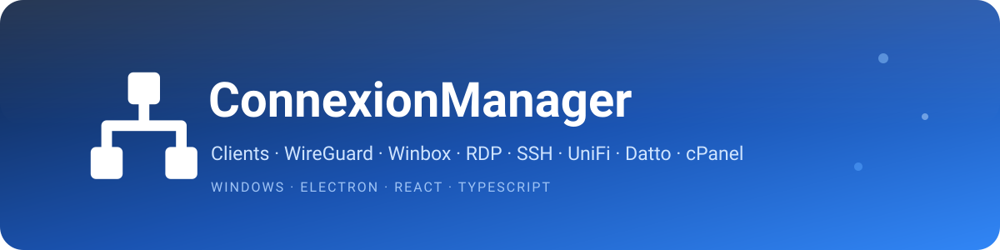

 

**Console réseau tout-en-un pour Windows : vos clients, WireGuard, Winbox/MikroTik, RDP, SSH, et vos portails web (UniFi, Datto, cPanel, Payfacto, GitHub + portails personnalisés) — dans une seule application, en onglets.**

---

## ✨ Onglets

### 👥 Clients
Regroupez vos connexions **par client**. Un client (nom + **tags** + notes) est stocké dans un dossier configurable ; sa fiche montre en un coup d'œil **toutes ses connexions** (WireGuard, Winbox, RDP, SSH) et propose des **raccourcis de création** pour chaque type.
- Chaque connexion peut être **reliée à un client** ; renommer un client **met à jour toutes ses associations**.
- **Statut en ligne / hors ligne** par client (d'après son Winbox associé), **colonne triable**.
- **Cases à cocher** pour **appliquer un tag à plusieurs clients d'un coup**.
- Classement par **tags**, recherche, notes.
- *(À venir : synchronisation des noms de clients depuis QuickBooks.)*

### 🛡️ WireGuard
Gère, classe, édite et active/désactive vos configurations WireGuard (`.conf`) rangées sur un NAS partagé, en pilotant le client WireGuard officiel.
- Dossier racine configurable (UNC `\\NAS\…` ou lecteur mappé `Z:\…`) ; arborescence de dossiers + surveillance auto.
- Connexion/déconnexion en un clic, statut temps réel, stats (handshake/volumes), **test de connexion** (ping).
- Éditeur formulaire/brut, création, duplication, renommage, déplacement, suppression.
- **Tags multiples** + association à un **client** (stockés hors du `.conf`, sans modifier votre configuration).
- **QR code** (onboarding mobile), **config MikroTik** (commandes RouterOS prêtes à copier), **mode exclusif**.

### 🔌 Winbox · 🖥️ RDP · 🐚 SSH
Trois carnets de connexions, même principe : un fichier `.json` par entrée *(nom, adresse, utilisateur, mot de passe **chiffré**, tags, client, VPN associé)* dans un dossier configurable.
- **Pastille de joignabilité** verte / rouge à gauche du nom : teste le **port du service** (Winbox 8291, RDP 3389, SSH 22), plus fiable qu'un simple ping ; « injoignable depuis X » dans le détail. Vérifié en arrière-plan (~10 min).
- **Tags multiples** (barre latérale + filtrage) et association à un **client**.
- **VPN associé** : un tunnel WireGuard peut être **connecté automatiquement avant** l'ouverture de la session.
- **Connexion rapide** : se connecter à une adresse **sans enregistrer** la connexion.
- **Winbox** ouvre `winbox.exe` connecté au routeur · **RDP** ouvre **mstsc** avec identifiants injectés (`cmdkey`, natif) · **SSH** ouvre une fenêtre **PowerShell** `ssh user@hôte` (OpenSSH natif ; le mot de passe enregistré est copié dans le presse-papier).

### 🌐 Portails web (UniFi · Datto · Cpanel · Payfacto · GitHub · personnalisés)
Des navigateurs intégrés avec **session mémorisée** (connectez-vous une fois) :
- **UniFi** · **Datto** · **GitHub**.
- **Cpanel** *(onglet groupé)* : plusieurs cPanel en sous-onglets.
- **Payfacto** *(onglet groupé)* : VelPOS, PaxStore, Titan, OMR, NinjaOne en sous-onglets.
- **5 portails personnalisés** : définissez leur **nom**, leur **adresse (URL)** et leur **login** dans les réglages.
- **URL de chaque portail modifiable** + bouton **Pré-remplir** (identifiants chiffrés). Le **MFA** reste manuel.

### Transversal
⬆️ Mise à jour automatique (GitHub) · ⓘ fenêtre **Aide / À propos** (infos, mise à jour, lien du dépôt) · 🧷 barre système (tray) · 🎨 thèmes clair / sombre / **KPI** (gris + rouge) · 🔒 chiffrement des secrets.

## 🚀 Installation

1. Installez le [client officiel WireGuard](https://www.wireguard.com/install/) et, si besoin, [WinBox](https://mikrotik.com/download). SSH utilise le client **OpenSSH** intégré à Windows 10/11.
2. Téléchargez **`connexionmanager-<version>-setup.exe`** depuis la [page des _Releases_](https://github.com/ElCiment/ConnexionManager-release/releases/latest) et lancez-le.
3. Ouvrez les **Réglages** (⚙️ en bas de la barre d'onglets) et renseignez vos dossiers / chemins / portails.

> L'app tourne en droits normaux. Une **invite UAC** apparaît seulement pour connecter / déconnecter un tunnel WireGuard.
>
> L'exécutable n'est pas signé numériquement : au premier lancement, Windows SmartScreen peut afficher un avertissement → **Informations complémentaires → Exécuter quand même**. Les mises à jour suivantes sont ensuite automatiques.

## 🔒 Sécurité

- **WireGuard** : élévation UAC **par action** seulement ; le `.conf` est **copié en local** avant connexion (le service SYSTEM ne voit pas les lecteurs mappés) puis supprimé à la déconnexion ; clés privées jamais journalisées.
- **Mots de passe** : chiffrés au repos (AES-256-GCM). Niveau « obfusqué » (clé dans l'app), portable entre PC — adapté à des identifiants internes sur un partage privé, pas à un coffre-fort public.
- **Isolation** : navigateur intégré cloisonné, aucun accès direct au système depuis l'interface, communications internes typées.

## 📝 Licence

MIT.
